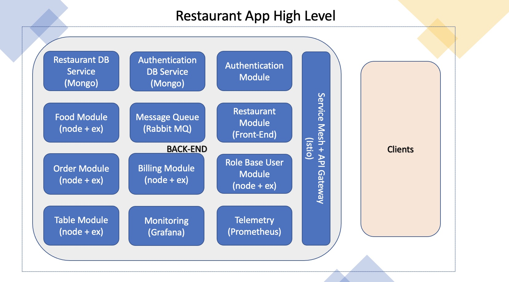
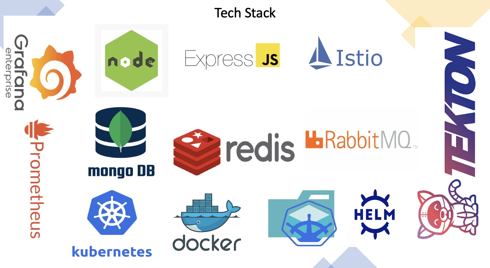

# Eatery: A Scalable web application on Kubernetes

This repository conatains code for Scalable web app built using 
1. [Node.js](https://nodejs.org/en/)
1. [Express.js](https://expressjs.com)
1. [Istio](https://istio.io)
1. [Mongo](https://www.mongodb.com)
1. [Redis](https://redis.io)
1. [Rabbit MQ](https://www.rabbitmq.com)
1. [Helm Charts](https://helm.sh/docs/topics/charts/)

Hosted on containers using [Kubernetes](https://kubernetes.io/), tested on local machine using [Minikube](https://minikube.sigs.k8s.io/docs/) and [Skaffold](https://skaffold.dev).

Managed by full pahsed automeated CI/CD pipleine using [Tekton](https://tekton.dev). 

Also incoporated with Telemetry and Monitoring support using [Grafana](https://grafana.com) and [Prometheus](https://prometheus.io)

Containers are a standard way to package apps and all their dependencies so that you can seamlessly move the apps between environments. Unlike virtual machines, containers do not bundle the operating system. Only the app code, run time, system tools, libraries, and settings are packaged inside containers. Containers are more lightweight, portable, and efficient than virtual machines.

 The templates generate Helm charts that describe the application’s initial Kubernetes deployment configuration, and are easily extended to create multi-image or complex deployments as needed.

## High Level Architecture 

## Tech Stack 

